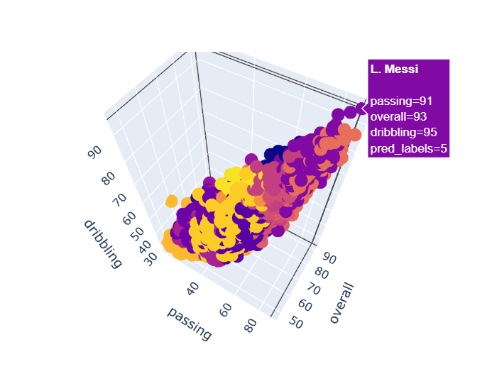

<h1> Player Recommendation Application </h1>

<h3> Data Science Capstone Project </h3>

### Instructions

1. Datasets stored in data directory
2. First run EDA notebooks and then run modelling notebooks for male and female players
3. After EDA two files are saved as 'data/player_abilities.csv' and 'data/female_player_abilities.csv'. These two files are used for modelling
4. After modelling the results are saved as 'models/male_pca_result.csv' and 'models/female_pca_result.csv' respectively.
5. The app_home.py and tests.py of  the streamlit app file in the root directory uses the data and models directories.

### Running the Application

1. Go to Root directory and activate streamlit environment
2. streamlit app_home.py

### Testing the Application

1. Go to Root directory and activate streamlit environment
2. python tests.py

