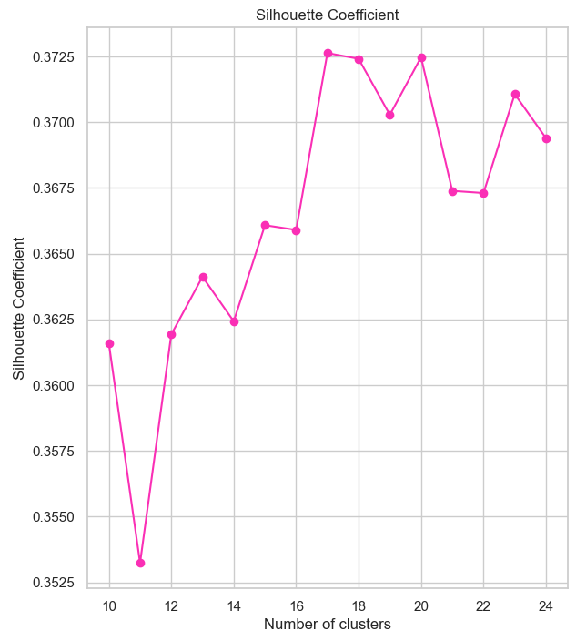
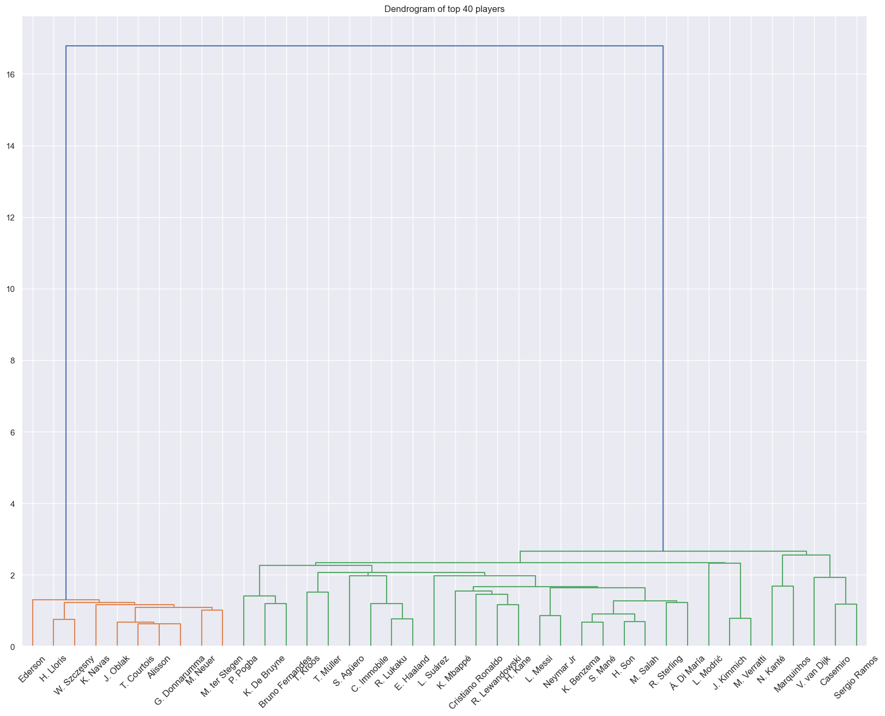

<h1> Player Recommendation Application :soccer: </h1>

### :seedling: Introduction 

This project aims to find the right footballer to replace another player. In order to replace Neymar and Iniesta, FC Barcelona spent more than 400 million pounds on just 3 player acquisitions in the years 2018 and 2019. And all three failed to replace and create an impact. This resulted in the club spending too much and bringing huge debts. Similarly, Manchester United has spent over £1 billion and has continued to struggle over the past decade.

The project aims to find solutions to the following problems:

<ol>
    <li>	Let's say player X departs a team, and the team needs a player who is similar to the player who is departing.</li>
    <li>	Clubs occasionally fail to sign their top transfer targets for a variety of reasons. Then they would have to choose the best alternate signing.</li>
    <li>	Coaches occasionally have to select a versatile player to replace one who is currently playing in a different position owing to an injury or another circumstance. </li>
</ol>

### Data Collection
<ul>
<li>The FIFA dataset had separate files for male and female players</li>
<li>Player dataset had 19239 rows and 110 columns, and the count of player abilities columns was over 50 </li>
<li>Player abilities in FIFA 22 game data is on a scale of 0-100</li>
<li>The reduced Data format includes player abilities like dribbling, passing, shooting, pace, positioning etc.</li>
</ul>

### Feature Engineering
<ul>
<li>Positional Versatility was considered, and a separate column was added to include no of positions</li>
<li>Work rate column was divided into 2 new columns</li>
<li>Label encoded columns 'preferred_foot', 'work_rate1', 'work_rate2', 'first_position','body_type'</li>
<li>27 player positions were identified </li>
<li>Filled the player abilities stats will null values with 0</li>
<li>Finally Shortlisted 50 player columns</li>
</ul>

### Modelling
<ul>
<li>For modelling purposes, unsupervised clustering approaches were used.</li>
<li>KMeans, KMeans(with PCA), KMeans(with t-SNE), Hierarchical Clustering and DBSCAN were used to cluster the players.</li>
<li>Separate modelling was done for male and female players</li>
</ul>

### :book: Instructions

1. Datasets stored in data directory
2. First run EDA notebooks and then run modelling notebooks for male and female players
3. After EDA two files are saved as 'data/player_abilities.csv' and 'data/female_player_abilities.csv'. These two files are used for modelling
4. After modelling the results are saved as 'models/male_pca_result.csv' and 'models/female_pca_result.csv' respectively.
5. The app_home.py and tests.py of  the streamlit app file in the root directory uses the data and models directories.

### :runner: Running the Application

<a href="https://aditya2695-player-recommendation-application-app-home-eu6qy9.streamlitapp.com/">Player Recommendation Application</a>

1. Go to Root directory and activate streamlit environment
2. streamlit app_home.py

 
 
<table>
<tr>
    <th>3D cluster plot of dribbling,passing and overall</th>
    <th>Silhoutte score for different k values</th>
</tr>
<tr>
    <td></td>
    <td></td>
</tr>

<tr>
    <th>Heirarchical Cluster Dendrogram</th>
    <th></th>
</tr>
<tr>
    <td></td>
    <td></td>
</tr>

</table>

### :microscope: Testing the Application

1. Go to Root directory and activate streamlit environment
2. python tests.py

