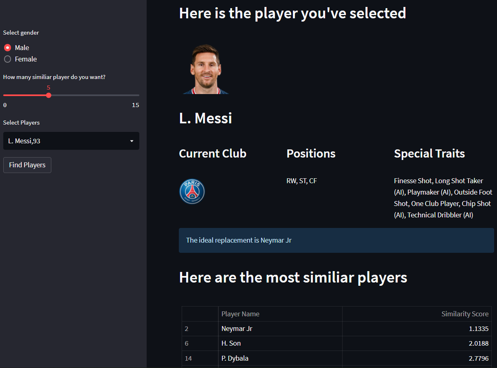

<h1> Player Recommendation Application </h1>

<h4>Introduction <h4>

This project aims to find the right footballer to replace another player. In order to replace Neymar and Iniesta, FC Barcelona spent more than 400 million pounds on just 3 player acquisitions in the years 2018 and 2019. And all three failed to replace and create an impact. This resulted in the club spending too much and bringing huge debts. Similarly, Manchester United has spent over £1 billion and has continued to struggle over the past decade.

The project aims to find solutions to the following problems:

<ol>
    <li>	Let's say player X departs a team, and the team needs a player who is similar to the player who is departing.</li>
    <li>	Clubs occasionally fail to sign their top transfer targets for a variety of reasons. Then they would have to choose the best alternate signing.</li>
    <li>	Coaches occasionally have to select a versatile player to replace one who is currently playing in a different position owing to an injury or another circumstance. </li>
</ol>

### Instructions

1. Datasets stored in data directory
2. First run EDA notebooks and then run modelling notebooks for male and female players
3. After EDA two files are saved as 'data/player_abilities.csv' and 'data/female_player_abilities.csv'. These two files are used for modelling
4. After modelling the results are saved as 'models/male_pca_result.csv' and 'models/female_pca_result.csv' respectively.
5. The app_home.py and tests.py of  the streamlit app file in the root directory uses the data and models directories.

### Running the Application

<a href="https://aditya2695-player-recommendation-application-app-home-eu6qy9.streamlitapp.com/">Player Recommednation Application</a>

1. Go to Root directory and activate streamlit environment
2. streamlit app_home.py

### Testing the Application

1. Go to Root directory and activate streamlit environment
2. python tests.py

